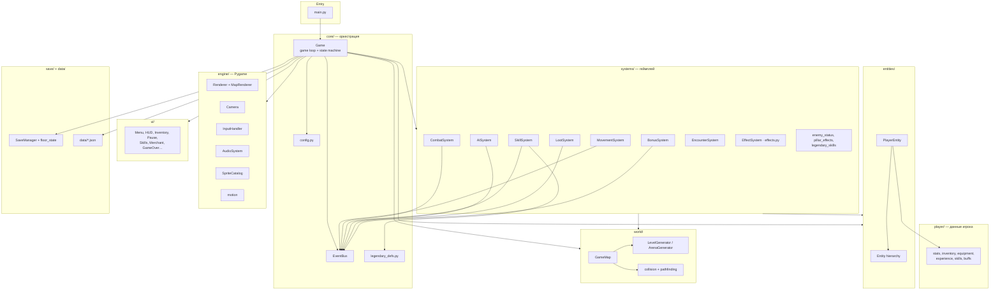
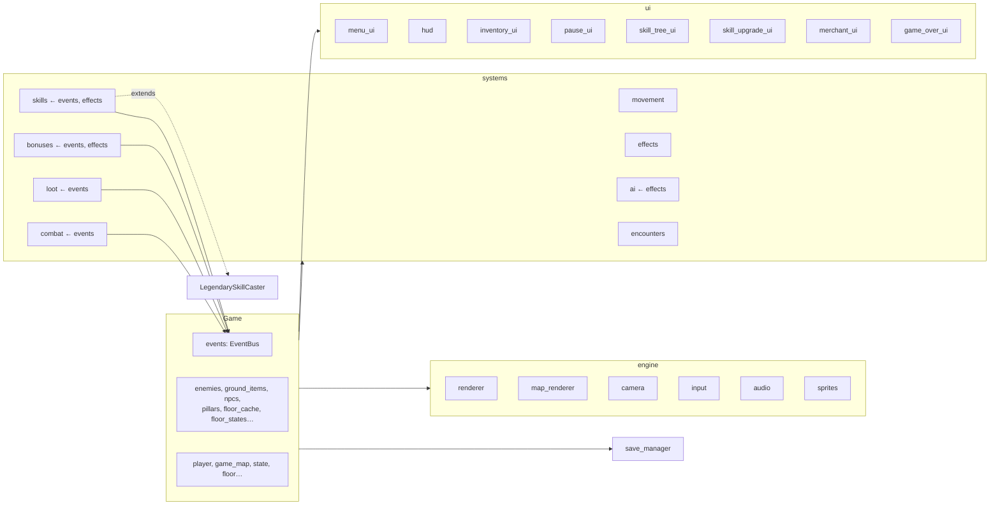
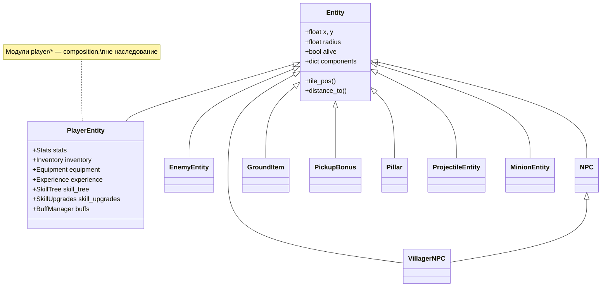
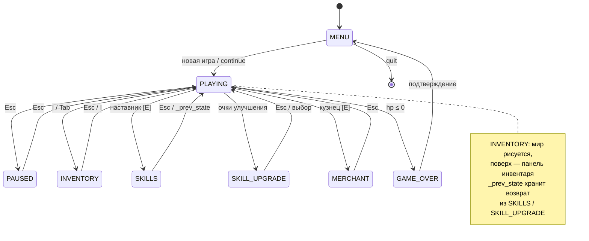
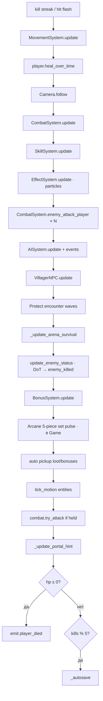
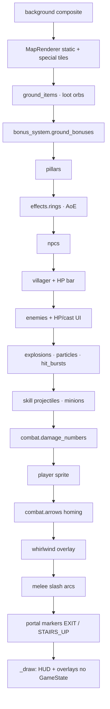
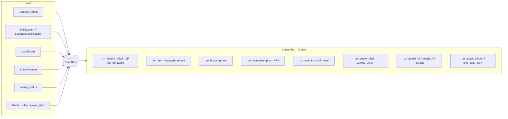
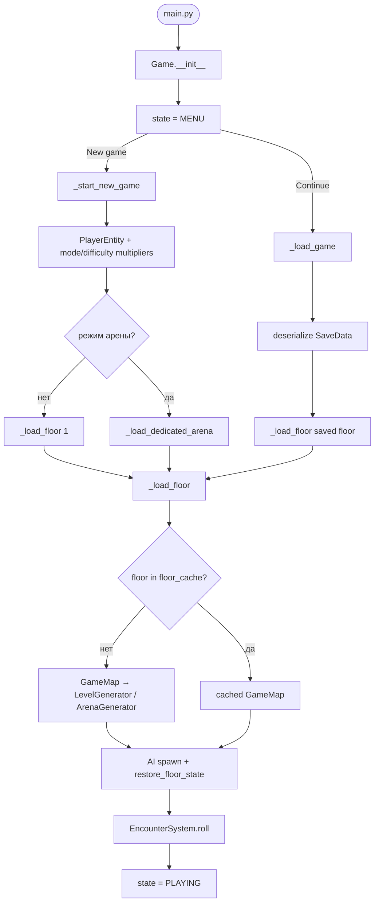
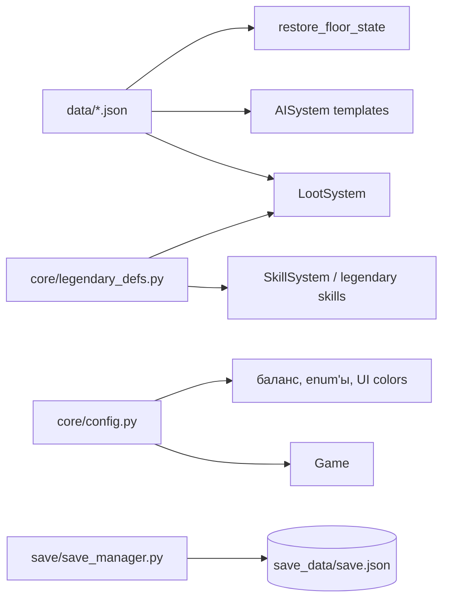

# Архитектура Pythonablo

Документ для навигации по коду и для переноса в [draw.io](https://app.diagrams.net/) после проверки Mermaid.

**Стек:** Python 3, Pygame ≥ 2.5.0, один процесс, без сети.

**Паттерны (кратко):**

| Есть | Нет |
|------|-----|
| Машина состояний (`GameState`) | ECS (только лёгкий `Entity.components`) |
| Системы, вызываемые из `Game` | MVC |
| `EventBus` (pub/sub) | Глобальный singleton шины |
| Data-driven (`data/*.json`, `config.py`) | Мультиплеер |

**Заметка:** `systems/effect_system.py` не подключён к `Game`. VFX и частицы — `systems/effects.py`.

---

## 1. Слои и пакеты



---

## 2. Композиция `Game`

`Game` (`core/game.py`) — единственный оркестратор: создаёт зависимости, держит списки мира, вызывает системы по порядку.



**Связи при создании (`Game.__init__`):**

- `CombatSystem(self.events)`
- `SkillSystem(self.events, self.effects)` — наследует `LegendarySkillCaster`
- `AISystem(self.effects)`
- `LootSystem(self.events)`, `BonusSystem(self.events, self.effects)`
- `EncounterSystem()` — без шины, вызывается из `Game` при загрузке этажа

---

## 3. Иерархия сущностей



---

## 4. Машина состояний `GameState`



---

## 5. Главный цикл (один кадр)

```mermaid
sequenceDiagram
  participant Loop as Game.run
  participant Ev as pygame events
  participant Inp as InputHandler
  participant Up as _update
  participant Dr as _draw
  participant Disp as display

  loop while running
    Loop->>Loop: dt = min(tick/FPS, 0.05)
    Loop->>Ev: _handle_events()
    Ev->>Inp: key/mouse
    Loop->>Up: _update(dt)
    Loop->>Dr: _draw()
    Loop->>Disp: flip()
  end
```

---

## 6. Порядок `_update_playing`

Вызывается только при `state == PLAYING` (и частично при `INVENTORY` / `MERCHANT` — см. `_update`).



---

## 7. Порядок отрисовки `_draw_world`

Снизу вверх (задний план → передний).



---

## 8. EventBus

Один экземпляр на `Game`, передаётся в системы, которые эмитят события.



| Событие | Основные emitters |
|---------|-------------------|
| `enemy_killed` | combat, skills, legendary, bonus, enemy_status, game |
| `enemy_hit` | combat, skills, legendary |
| `attack_swung` | combat |
| `skill_cast` | skills, legendary |
| `item_dropped` / `item_picked` / `inventory_full` | loot |
| `bonus_picked` | bonus |
| `legendary_proc` | combat |
| `goblin_hit` | combat |
| `player_died` | combat, game |

---

## 9. Загрузка игры и этажа



**Персистентность этажа:** `floor_states[floor]` — снимок врагов/лута/бонусов; `floor_cache[floor]` — сгенерированная карта.

---

## 10. Зависимости данных



---

## Следующий шаг: draw.io

После правок в этом файле можно запросить базовый `.drawio` (страницы 1–4: слои, `Game`, state machine, event bus). Раскладку и стили лучше довести вручную в diagrams.net.

**Проверка Mermaid:** [mermaid.live](https://mermaid.live) или предпросмотр Markdown в IDE.
